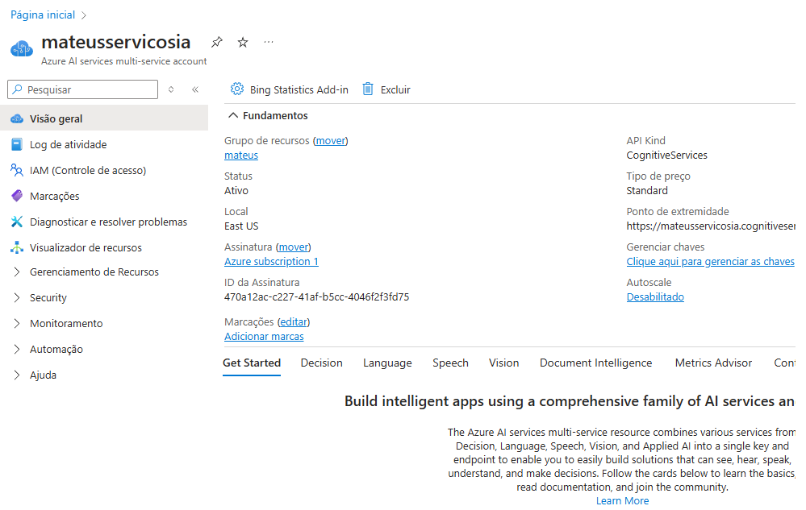
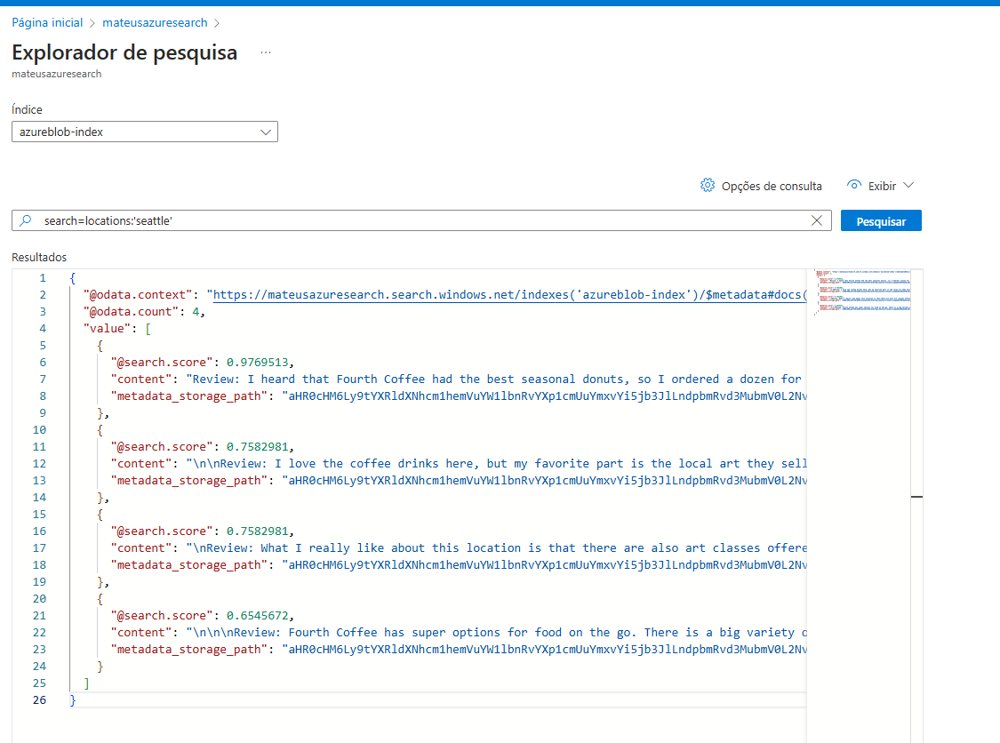
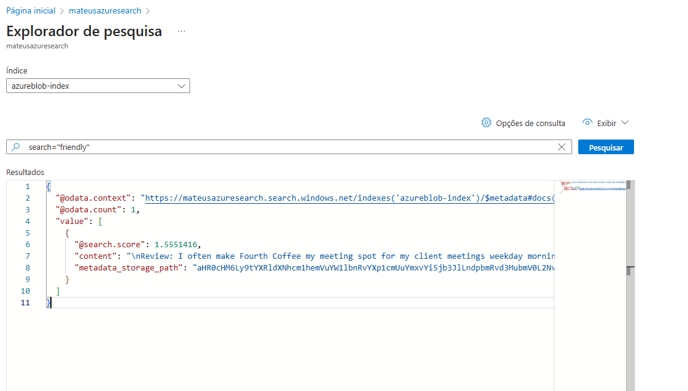
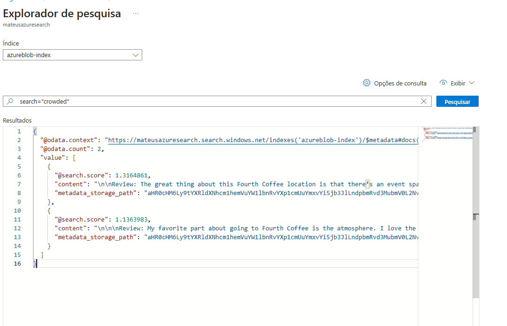
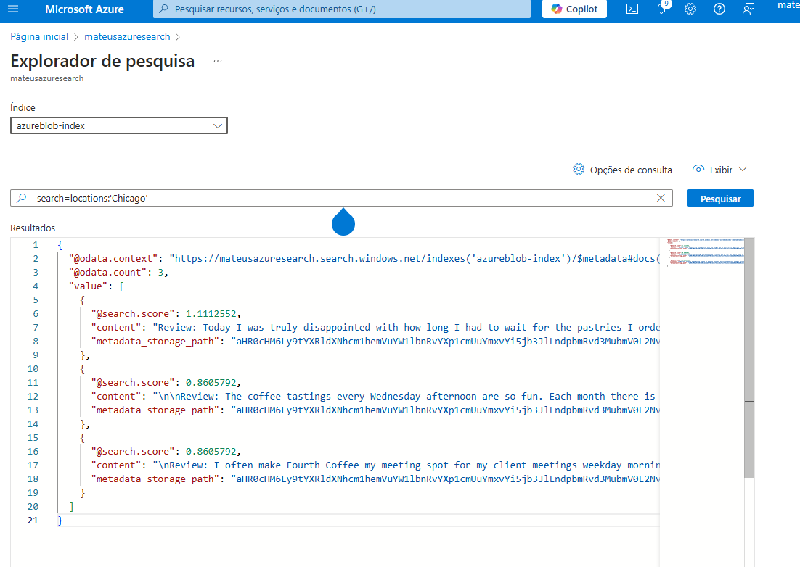
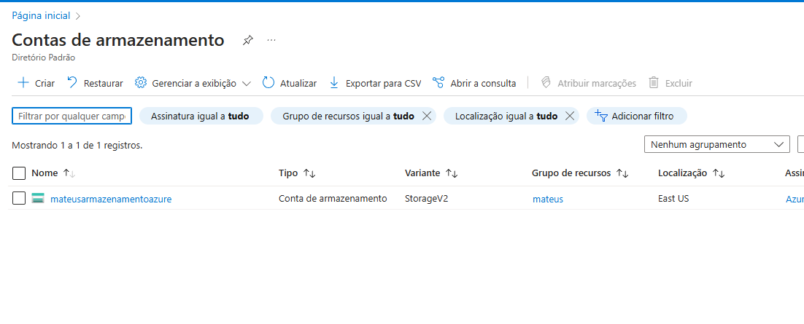

# Azure AI Search - Configuração e Insights

Este documento descreve o processo de configuração do **Azure AI Search** integrado ao **Azure Storage** e outros **Azure Services**, explorando insights, possibilidades e aprendizados adquiridos durante o uso dessa ferramenta poderosa.

---

## 📌 1. Pré-requisitos
Antes de iniciar, certifique-se de ter:
- Uma conta no **Azure Portal** ([portal.azure.com](https://portal.azure.com))
- Um **Azure Cognitive Search Service** configurado
- Um **Azure Storage Account** para armazenar os dados
- O **Azure SDK** instalado localmente ou acesso à API REST do Azure
- Dados estruturados para indexação (JSON, CSV, etc.)

---

## ⚙️ 2. Passo a Passo da Configuração

### **1️⃣ Criando o Azure AI Search Service**
1. No **Azure Portal**, vá até **Criar um recurso**.
2. Pesquise por **Azure Cognitive Search** e clique em **Criar**.
3. Escolha um nome, plano de serviço e região adequada.
4. Após a criação, acesse o recurso e copie a **Chave de Administração** e a **URL do Serviço**.

### **2️⃣ Configurando o Azure Storage**
1. No **Azure Portal**, vá até **Armazenamento** > **Criar Conta de Armazenamento**.
2. Escolha um nome e uma região.
3. No recurso criado, vá até **Containers** e crie um container para armazenar seus documentos.
4. Faça o upload dos arquivos que deseja indexar no Azure Search.

### **3️⃣ Criando um Índice no Azure AI Search**
1. No **Azure Search**, vá até **Índices** > **Novo Índice**.
2. Defina os campos necessários (exemplo: `id`, `nome`, `descrição`, `sentimento`, `categoria`).
3. Configure os **Campos Pesquisáveis** e **Filtros** conforme necessário.
4. Salve e publique o índice.

### **4️⃣ Criando um Indexador para o Azure Storage**
1. No **Azure Search**, vá até **Indexadores** e clique em **Novo Indexador**.
2. Escolha **Azure Blob Storage** como origem de dados.
3. Selecione o container do **Azure Storage** onde seus arquivos estão.
4. Associe o indexador ao índice criado anteriormente.
5. Configure o agendamento de indexação (exemplo: a cada 24 horas).
6. Execute o indexador e verifique os logs para confirmar a indexação.

### **5️⃣ Consultando Dados via API**
Após indexar os dados, podemos consultá-los via API REST. Exemplo de requisição:

```http
GET https://<your-search-service>.search.windows.net/indexes/<your-index>/docs?api-version=2023-07-01-Preview&search=atraso
api-key: <your-api-key>
```

Ou usando o Azure SDK em Python:

```python
from azure.search.documents import SearchClient
from azure.core.credentials import AzureKeyCredential

service_name = "seu-servico"
index_name = "seu-indice"
api_key = "sua-api-key"

search_client = SearchClient(endpoint=f"https://{service_name}.search.windows.net/", index_name=index_name, credential=AzureKeyCredential(api_key))

results = search_client.search("atraso")
for result in results:
    print(result)
```

---

## 🔍 Insights e Possibilidades
- **Filtragem Inteligente**: Com campos como `categoria` e `sentimento`, é possível refinar pesquisas por relevância.
- **Integração com Chatbots**: Chatbots podem consumir o Azure AI Search para responder perguntas baseadas em documentos indexados.
- **Análises Avançadas**: Combinando o Azure AI Search com **Azure AI Text Analytics**, é possível extrair insights como **análise de sentimentos**.
- **Automação com Azure Functions**: Agende reindexações automáticas ao detectar novos documentos no Storage.

---

## 🎓 Aprendizados Adquiridos
- **Otimizar a Estrutura do Índice** melhora a performance da pesquisa.
- **Monitoramento do Indexador** é essencial para garantir que os dados estejam sempre atualizados.
- **Uso de Analisadores** (como `standard-lucene`) pode aprimorar a precisão da busca.
- **Limitações de Plano**: Algumas funcionalidades avançadas podem exigir um plano **Standard ou Premium** do Azure AI Search.

---
## Exemplos de Utilização









## 🚀 Conclusão
- Achei interessante a flexibilidade na questão de buscas, é possivel refinar bastante para puxas os dados que deseja.
- Achei a automatização bem versátil no sentido de conseguir colocar todos dados em um container e depois puxar de uma vez para o sistema de busca para realizar a filtragem.
- Acredito que os casos de usos sejam empresas focadas em atendimento ao cliente e E-commerces, ambas conseguem desfrutar essas consultas e filtragens para automatizar ao seu desejo.
- De bonûs aprendi a editar o read.me pelo vscode e só depois subir para o github, antigamente editava apenas no github.

Caso queira aprofundar mais, consulte a [documentação oficial](https://learn.microsoft.com/en-us/azure/search/) do Azure Cognitive Search.

🔗 **Happy coding!** 🚀